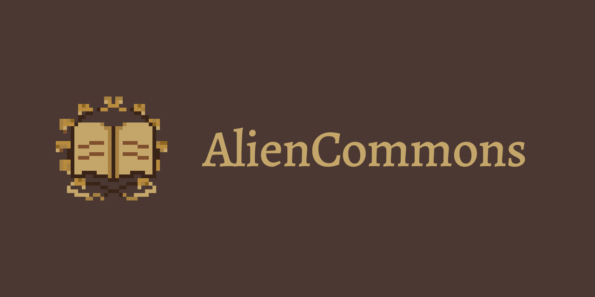

  

<!-- README-I18N:START -->

[English](./README.md) | **中文**

<!-- README-I18N:END -->

[概述](#概述) • [文档](#文档) • [部署环境](#部署环境) • [许可证](#许可证)

## 概述

AlienCommons 是面向技术向 Minecraft 玩家构建的社区平台，为玩家提供发布文章和参与讨论的空间。

项目目前仍处于早期阶段，并在密集开发中。

## 文档

| 受众      | 描述                     | 链接                                       |
| --------- | ------------------------ | ------------------------------------------ |
| 用户      | 平台使用指南、社区规范   | [`docs/users/`](docs/users/)               |
| 贡献者    | 架构、环境搭建、开发流程 | [`docs/contributors/`](docs/contributors/) |
| AlienMark | Markdown 语法参考和 API  | [`docs/alienmark/`](docs/alienmark/)       |

所有文档均提供英文和中文版本，使用 [Zensical](https://zensical.org/) 构建。

请注意，在当前阶段，部分资料可能尚未完全保持最新。

## 部署环境

AlienCommons 使用三个环境：

- **`dev`** — 本地开发，使用 Docker Compose
- **`stg`** — 预发布环境，托管于 AWS，尽可能与生产环境一致
- **`pro`** — 生产环境，托管于 AWS，使用 Cloudflare DNS 解析 `aliencommons.com`

## 许可证

AlienCommons 的源代码和文档采用 [MIT 许可证](LICENSE)。AlienCommons
名称、徽标、文字标志及其他品牌素材不属于 MIT 许可证的授权范围，而是适用独立的
[AlienCommons 品牌素材许可证](branding/LICENSE)。

完整的许可证适用范围参见 [COPYING.md](COPYING.md)。
