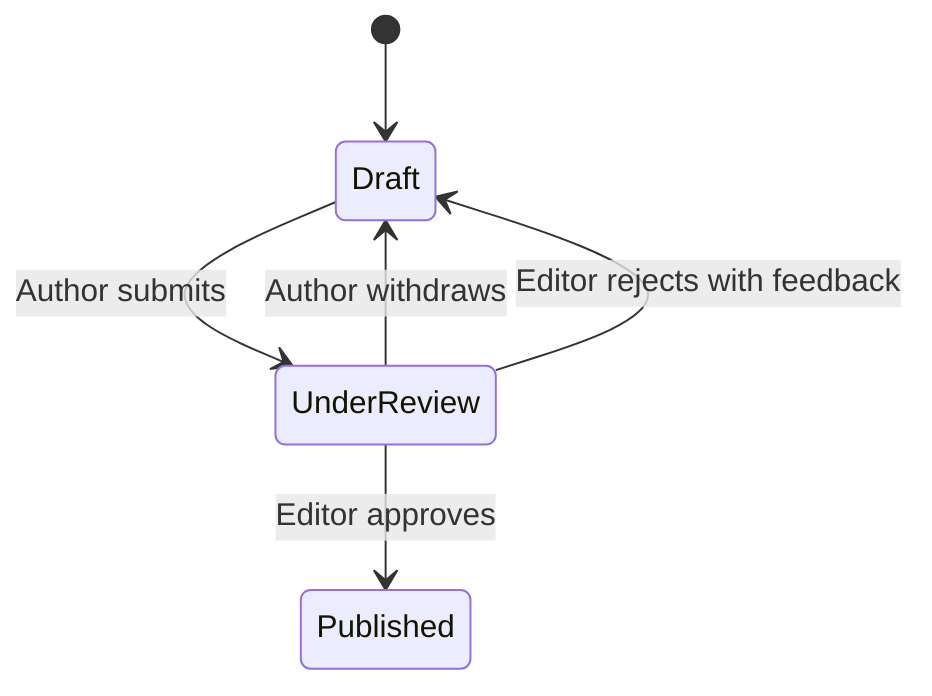

# Columns

Formal columns are the core content type of AlienCommons. They are suitable for complete technical writing intended for long-term reading.

## Basic Content

A column contains:

- A title
- Body content
- A cover image
- A summary
- One or more authors
- Free-form tags entered by authors

Whether the summary may be empty is still undecided. Categories and original-language metadata are not currently planned.

## Body Capabilities

The body may include:

- Images
- Code blocks
- Mathematical formulas
- External links
- Video link cards for platforms such as YouTube and Bilibili

Videos are not directly embedded or uploaded in the body. Video content is displayed only as link cards.

## Displayed Information

A column page displays:

- Publication time
- Last modification time
- View count
- Like count
- Dislike count
- Bookmark count

## Work States

The basic publishing flow is:

Confirmed rules:

- Editors may leave revision feedback but cannot modify the text directly.
- A rejected work returns to the draft state.
- A work can be deleted only while it is a draft.
- Published works may be revised, but new versions must be reviewed again.
- While a new version is under review, the previous version remains public.
- The new version replaces the public version only after approval.
- A work unpublished by an editor is not deleted.

The state entered after unpublishing and whether an `Archived` state should be added are still undecided. See [Open Questions](open-questions.md).

## Collections

Authors may create collections to organize related works into a series.

Collection rules:

- A name is required.
- A description and cover image are optional.
- A work may belong to at most one collection.
- The collection creator must be one of the work's authors.
- The collection creator may manually reorder works.
- A collection page displays its creation time, update time, and bookmark count.
- Users may bookmark collections.
- Collections do not have comment sections.

Management permissions for multi-author works in collections are still undecided.
