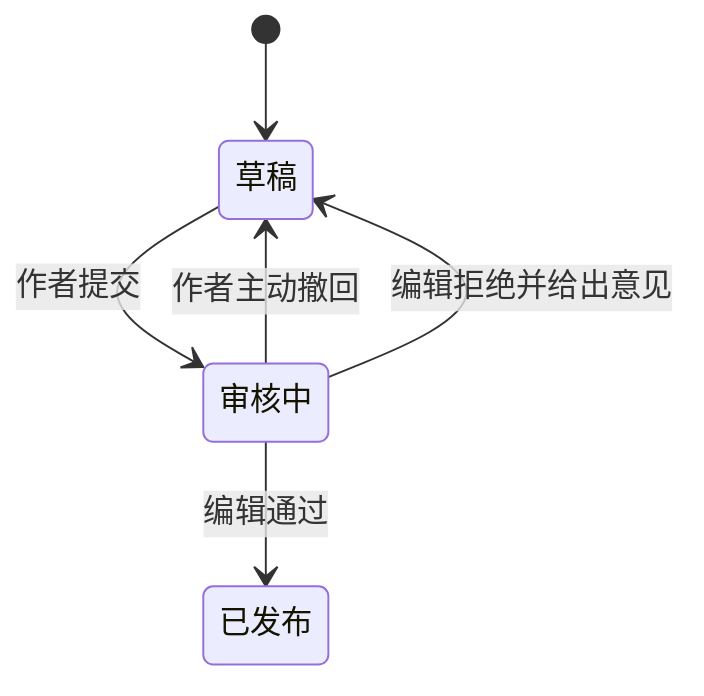

# 专栏作品

正式专栏是 AlienCommons 的核心内容类型。它适合完整、长期可读的技术表达。

## 基本内容

一篇专栏作品包含：

- 标题
- 正文
- 封面图
- 摘要
- 一位或多位作者
- 由作者自由填写的标签

摘要是否允许为空仍待确定。当前不考虑分类，也不记录原文语言。

## 正文能力

正文允许插入：

- 图片
- 代码块
- 数学公式
- 外部链接
- YouTube、Bilibili 等平台的视频链接卡片

正文不直接嵌入或上传视频。视频内容仅以链接卡片形式展示。

## 展示信息

作品页面显示：

- 发布时间
- 最后修改时间
- 浏览量
- 点赞数
- 点踩数
- 收藏数

## 作品状态

基础发布流程如下：

已确认的规则：

- 编辑可以给出修改意见，但不能直接修改正文。
- 审核失败后，作品回到草稿状态。
- 只有处于草稿状态的作品可以删除。
- 已发布作品可以修改，但新版本需要重新审核。
- 新版本审核期间，旧版本继续公开展示。
- 新版本审核通过后，才会替换线上公开版本。
- 被编辑撤稿的作品不会被删除。

撤稿后应进入何种状态，以及是否增加 `Archived` 状态，仍待确定。参见[开放问题](open-questions.zh.md)。

## 文集

作者可以创建文集（Collection），将自己的相关作品组织成系列。

文集规则如下：

- 名称必填。
- 简介和封面图可选。
- 一篇作品最多加入一个文集。
- 文集创建者必须是文章作者之一。
- 文集创建者可以手动调整作品顺序。
- 文集页面展示创建时间、更新时间和收藏数。
- 用户可以收藏文集。
- 文集不提供评论区。

多人协作作品加入文集后的管理权限仍待确定。
